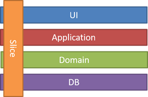

# Application Code Development

See [Microsoft Framework Design Guidelines](https://learn.microsoft.com/en-us/dotnet/standard/design-guidelines/)

This section is primarily aimed at Junior/Senior Software Engineers

>"Software is a constrained form of literature that communicates concepts from programmer and programmer, which is also executable by machines." *David Whitney*

## Be Mindful and Intentional

Code should be minimal and easy to understand.

Code should have form, flow and cohesion.

Reduce cognitive load on other developers and our later selves.

## Do Pair Programming

* Forces you to engage with users/PMS sooner
* Helps to foster a common development culture.
* Improves software quality.
* Reduces the need for extensive code reviews.
* Ensures intra-team knowledge transfer for:
  * Tools and ways of working.
  * Development best practices.
  * Business Knowledge.

## Use TDD/BDD

Because:

* It forces you to think exactly what you are asking of your code before you actually write the code.
* You only write just enough code to fulfil the specification.
* It stops you going down rabbit holes.
* Well written tests can even be legible to PMs and manual testers.

TDD ensures minimalist code. Less code means less chance of buggy code.

Steps:

* **Think**
* Write a failing test and get it to compile
  * Use your IDE code generation to generate code
  * Ensure it compiles.
  * **Run it to make sure it fails!**
* Write just enough code to make the test pass.
* Refactor the code mindfully to conform to SOLID/DRY principles.

## Use Warnings as Errors

Add the following to your .csproj files.

```xml
<TreatWarningsAsErrors>true</TreatWarningsAsErrors>
```

Sure you may get the occasional warning that is daft but you can then disable the warning and show why you've disabled it.

## Enforce Style Rules

Reduce the cognitive load on others reading your code by enforcing a consistent style. At a minimum there should be standards for:

* Indentation.
* Variable Names.
* Property Names.
* Private Member names.

In .NET you should be using EditorConfig files to enforce this issuing warnings. You need to work with your team to figure out what works and what doesn't and let the EditorConfig file democratically evolve.

## Don't Force Design Patterns

By all means use design patterns but it's not necessary to force your code into a design pattern. Don't be obsessive about them.

## Minimize Third-Party Libraries

This is particularly true of production code.

Third-party libraries introduce:

* Security issues:
  * Increased attack surfaces and vectors that are not under our control.
  * Libraries often become abandoned with no security fixes - especially npm.
* Maintainability:
  * Libraries can produce complex inter-dependencies - especially npm.
  * Libraries can make upgrading core framework problematic

When deciding to use a third-party library:

* Is it really needed?
* Can we write the functionality easily ourselves?
* Is it mature?
* Is it likely to be maintained?

## Use Dev Containers where Practical

I have often seen developers having issues with their Node.js environment such as incompatible Node.js and/or npm global package versions on especially Windows, machine. I've seen people spend hours on this.

The obvious solution to leverage dev containers in VSCode.

## Code Organisation

>"...organizing your code by architectural concept is about as meaningful as taking a classic car collection smashing all the cars apart and organizing it by wheels and windshields and boots and seats" ***David Whitney on Clean Architecture***

### Organise Folders By Feature Not Architectural Responsibility

.NET MVC projects have traditionally been organised in terms of architecture:

```terminal
Controllers/
  EmployeeController.cs
Views/
  Employee/
  Create.cshtml
  Delete.cshtml
  Edit.cshtml
  Index.cshtml
Models/
  EmployeeModel.cs
```

But organising by architectural responsibility:

* Decreases cohesion.
* Adds cognitive load.
* Adds navigation friction.
* Obfuscates intent.

Now consider organising by employee feature using vertical slicing:



We now have:

```terminal
Feature/
  Employee/
    CreateEmployeeView.cshtml
    DeleteEmployeeView.cshtml
    EmployeeController.cs
    EmployeeModel.cs
    EditEmployeeView.cshtml
    EmployeeView.cshtml        
```

This is better because:

* Everything pertaining to Employee is viewable in one folder.
* Less navigation required.
* We can see exactly what we are working on by glancing at the filename.
* We have more cohesion.

See [Restructuring to a Vertical Slice Architecture](https://www.youtube.com/watch?v=cVVMbuKmNes)

### Separating Concerns

Try doing three projects:

* .Core with the business logic
* .Api, .Web or .Console for the code entrypoint.
* Test projects
* Any IaaC (e.g. Terraform, Helm Charts CI/CD YAML)

## Query Data Efficiently

The use of repository pattern tools like EF Core frequently result in more data being returned than are required for the use case.

**Only do this in development...**

If you want to see what SQL queries is actually making you can set the logging level as follows in your ``appsetting.json``:

```json
{
  "Logging": {
    "LogLevel": {
      // Others ommited
      "Microsoft.EntityFrameworkCore.Database.Command": "Information"
    }
  }
}
```

Microsoft have an [Efficient Querying](https://learn.microsoft.com/en-us/ef/core/performance/efficient-querying) guide for EF core.

## Do .NET Logging Right

This applies to .NET microservices.

* Use Serilog correctly.
* Use ILogger instead of static instance.
* Use structure logging.
* Only log what is needed.
* DO NOT USE string interpolation or concatenation
  * Large strings can crash the service and you won't know why because there's no log!
* Use enrichment to ensure all necessary information is present:
  * E.g. User ID, Correlation ID, Request URL, App Version
* Consider project/platform-wide library to enforce best practices.
* Ensure that you are logging at the correct level:
  * (Debug, Information, Warning, Error, Critical).
  * Prefer Debug when possible
* Only log developer focused technical issues.
  * I have seen testers/PMs requesting business logic proof.
* Establish a log retention policy.
* Do not use Serilog for contractual/legal audit records - it is not guaranteed.
  * I have seen instances where Serilog fails silently.

## Metrics

Two types:

* Application (Promethus - CPU, Memory)
* Business - How long a user stayed on a page.
* Metrics retention policy

## Security

* Add `[Authorize]` everywhere!
* Forget once and you're wide open.
* Add a FallbackPolicy:

```csharp
builder.Services.AddAuthorizationBuilder()
  .SetFallbackPolicy(new AuthorizationPolicyBuilder()
  .RequireAuthenticatedUser()
  .Build());
```

## Validating Data

DO NOT use Data Annotations:

* SRP violation (Model and Validation in one class)
* Hard to test correctly

Instead use FluentValidation:

* Business rules are easier to read
* Easy to show to a stakeholder
* Easy to test
* Does not violate SRP
* Integrates with ModelSTate.IsValid

## Remove Server Header

By default Microsoft add a server header to Kestrel which shows hackers you are running a .NET microservice.

```csharp
builder.WebHost.UseKestrel(options => options.AddServerHeader = false);
```

## Avoid using IOptions

* Violates Dependency Inversion Principle
* Hard to test
* Hard to verify configuration
* Harder to debug

Instead map a class or record to the section and perform any validation as required e.g.:

```csharp
IConfiguration configuration = new ConfigurationBuilder()
  .AddJsonFile("appsettings.json")
  .Build();

MailSettings mailSettings = configuration.GetSection("MailSettings").Get<MailSettings>() 
  ?? throw new Exception("MailSettings config not found.");

var mailSettingsValidator = new MailSettingsValidator();
var validator = mailSettingsValidator.Validate(mailSettings);
if(!validator.IsValid)
  throw new Exception($"MailSettings are invalid: {validator.Errors.ToString}");

builder.Services.AddSingleton<MailSettings>(mailSettings);

builder.Services.AddAuthorizationBuilder()
  .SetFallbackPolicy(new AuthorizationPolicyBuilder()
  .RequireAuthenticatedUser()
  .Build());

public sealed record MailSettings {
  public string? SmtpServer { get; set; }
  public string? FromAddress { get; set; }
}

public sealed class MailSettingsValidator : AbstractValidator<MailSettings> {
    public MailSettingsValidator()
    {
      RuleFor(mailSettings => mailSettings.SmtpServer)
        .NotNull();
      RuleFor(mailSettings => mailSettings.FromAddress)
        .NotNull()
        .EmailAddress();
  }
}
```

## Make Classes and Records Sealed 

This ensures we maintain the highest performance.

[See this video](https://www.youtube.com/watch?v=d76WWAD99Yo) for details.

## Add Version API endpoint with Build Details

Add a version file on something on and endpoint like ``api/version`` that reads a file in the format:

```txt
<Date><BuildNumber><ShortGitSha>
```

This file can be generated in on the CI deploy pipeline and adds a sanity check.

## Coding Logic

Happy bath at the bottom of a method eliminates nesting.

The indented your code is the harder it is to follow.

Early return statements for error paths.

Warning signs:

* Methods > 20 lines
* Classes > 200 lines

Don't use regions - add new classes!

## HTTP Security Headers

* Tells a browser what extra rules to enforce
* Protects against MITM, clickjacking, cross-site scripting, and more
* Be careful!
* [NetEscapades.AspNetCore.SecurityHeaders](https://github.com/andrewlock/NetEscapades.AspNetCore.SecurityHeaders)

[Video](https://www.youtube.com/watch?v=7MWXTXjtl8s)

[Test yours here](https://securityheaders.com/)

## ValidateOnBuild

Some errors are only shown in development environment but not in production so as not to break legacy code.

Force this validation in production as follows:

```csharp
builder.Host.UseDefaultServiceProvider(config => {
  config.ValidateOnBuild = true;
});
```

## Automated Testing

### Tooling

* Have a regression test suite.
  * Make changes quickly and confidently.
  * Exposes holes in your architecture.
* Use XUnit or NUnit (NOT MSTest)
* xUnit is used by the APS.NET team
* Use FluentAssertions
  * More natural tha Assert.Equal
  * More domain like language
  * Can be read by business.

```csharp
  // Fluent Assertions
  returnedStaffMember.Forename.Should().Be("Colin");
  returnedStaffMember.Department.Should().Be("Accounts");
```

Easily extensible for something akin to Domain Specific Language

### Test Construction

* Name the tests consistently
  * Stick to camel case or underscores
* Only add the data you're testing (Checkov's Gun)
* If you are performing too much setup in the test you probably want to move that to the constructor:
  * This reduces the need to refactor every test if dependencies change.
* If you have too much setup and/or logic in your constructor you may need to create a new test class.
* If you tests are using too many mocks:
  * That part of your application may be too tightly coupled
  * You probably want to consider refactoring.

### Integration Testing .NET APIs

* For API integration tests use a WebApplicationFactory based fixture:
  * Use the Program.cs Or Startup.cs so you are spinning up the entire service.
  * Call the actual endpoint.
  * Only mock the external service API responses.

Example replacing:

* 
* The DBService with a temporary SQLite database

```csharp

public class CustomWebApplicationFactory<TProgram>
    : WebApplicationFactory<TProgram> where TProgram : class
{
    protected override void ConfigureWebHost(IWebHostBuilder builder)
    {
        builder.ConfigureServices(services =>
        {
            var dbContextDescriptor = services.SingleOrDefault(
                d => d.ServiceType ==
                    typeof(DbContextOptions<ApplicationDbContext>));

            services.Remove(dbContextDescriptor);

            var dbConnectionDescriptor = services.SingleOrDefault(
                d => d.ServiceType ==
                    typeof(DbConnection));

            services.Remove(dbConnectionDescriptor);

            // Create open SqliteConnection so EF won't automatically close it.
            services.AddSingleton<DbConnection>(container =>
            {
                var connection = new SqliteConnection("DataSource=:memory:");
                connection.Open();

                return connection;
            });

            services.AddDbContext<ApplicationDbContext>((container, options) =>
            {
                var connection = container.GetRequiredService<DbConnection>();
                options.UseSqlite(connection);
            });

            
            var myExternalAPIService = services.SingleOrDefault(
                d => d.ServiceType ==
                    typeof(myExternalAPIService));

            services.Remove(myExternalAPIService);

            srevices.AddTransianet

        });

        builder.UseEnvironment("Development");
    }
}
```

[Further reading](https://learn.microsoft.com/en-us/aspnet/core/test/integration-tests?view=aspnetcore-8.0)

## Central Package Management

* Enables the entire solution to use the same versions.
* Use [``Directory.Packages.props``](https://devblogs.microsoft.com/nuget/introducing-central-package-management/) in the root of your solution
* Omit the version attribute to force latest package
* In some instances you may need to use the ``VersionOverride``

```xml
<Project Sdk="Microsoft.NET.Sdk">
  <PropertyGroup>
    <TargetFramework>net6.0</TargetFramework>
  </PropertyGroup>
  <ItemGroup>
    <PackageVersion Include="Newtonsoft.Json" />
    <PackageReference Include="PackageA" VersionOverride="3.0.0" />
  </ItemGroup>
</Project>
```

## Use CI/CD Pipelines

Use confident Green:

* When the build pipeline goes green you should be confident that it can go into production.
* If you are not write automated tests to ensure that you have that confidence!
* Don't use manual tests.

## Feature Toggles

AKA [Feature Flags](https://learn.microsoft.com/en-us/azure/azure-app-configuration/use-feature-flags-dotnet-core)

Use to deploy features that you don't want to make available in production.

You can configure a feature to be enabled for a large number of criteria.

See also Argo Rollouts in [Deployment Pipelines](./deployment-pipelines.md#deployment-strategies)

## Work in small batches

Deploy frequently - every day!

## Use Correlation Middleware

Use this to track requests across a distributes system. Ensure it is logged.

Add code to your LogEnricher to retrieve this id and log it appropriately.
