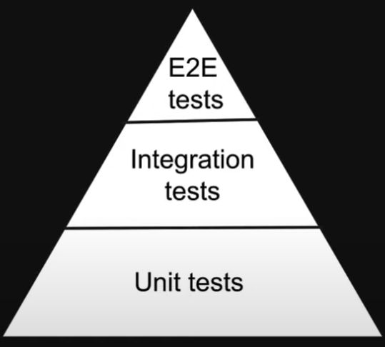

# React/Typescript Automated Testing

## Jest

[Jest](https://jestjs.io/) is a testing framework that:

* Finds tests in your application
* Runs those tests
* Determines whether those test passed or failed
* Reports the results

## React Testing Library

The [React Testing Library](https://testing-library.com/docs/react-testing-library/intro/)(**RTL**) is a Javascript/Typescript testing utility that provides a virtual DOM for testing React components.

It is part of **Testing Library** family which provides utilities to help test UI components. It is a wrapper around the core **DOM Testing Library** that enables easier testing of React UI components.

## Types of Test Clarification

### Unit Tests

* Tests an individual component 
* Each building-block is tested in isolation
* Dependencies outside the component are mocked
* Quickest test to run
* Easier to write and maintain

### Integration Tests

* Test a combination of components
* Take longer than unit tests

### E2E Testing

* Tests entire application flow
* Uses real dependencies such as:
  * Database
  * UI
  * Services
* Take the longest to run.
* Are often the easiest tests to break.
* Typically have a a larger cost implication as they will need consume more resources

## What should we be writing?



Moving bottom to top give more confidence but tests are more brittle.

### RTL Philosophy

>"The more the test resemble the way your software is used, the more confidence they can give you."

So test using RTL strike a balance between unit tests and E2E tests that mimic a user's interaction.

Using RTL measn that we are not concerned with the implementation details of the component. 

Instead we are testing behaviour with how a user interacts with it.

Refactoring will not affect the validity of the test so it is perfect for TDD!

## Project Setup

### Create Project Using Vite

```bash
npm create vite@latest MyApp -- --template react-swc-ts
cd MyApp
# Install dependencies
npm install
# Check it works:
npm run dev
```

### Add and Configure Jest and React Testing Library

```bash
npm install --save-dev jest @testing-library/react ts-jest @types/jest
npx ts-jest config:init
```

The last command creates a ``jest.config.js`` file.

Vite creates two typescript config files that seem to confuse Jest and will give you an error like the following:

```bash
    src/__test__/App.test.tsx:5:12 - error TS17004: Cannot use JSX unless the '--jsx' flag is provided.
```

To get around this you can copy the contents of tsconfig.app.json into tsconfig.json.

Please add a bug if anyone can figure how to specify which config file. There is a workaround [here](https://huafu.github.io/ts-jest/user/config/tsConfig) but the ``globals`` jwst.config section is deprecated.


Finally add ```"test": "jest"``` to the scripts section of the package.json:

```json
  "scripts": {
    //...
    "test": "jest"
  }
```

### Add a Test and Run It


```typescript
// src/__test__/App.test.tsx
import { render } from "@testing-library/react"
import App from "../App"

test('demo', () => {
    expect(true).toBe(true)
})

test("Renders the main page", () => {
    render(<App />)
    expect(true).toBeTruthy()
})
```

```bash
npm run test
```

Now you will get an error on importing the reactLogo svg file.

### Fixing svg Imports

```bash
npm install --save-dev ts-node @testing-library/jest-dom jest-environment-jsdom
```

## Further Reading

* [Video Tutorial](https://www.youtube.com/playlist?list=PLC3y8-rFHvwirqe1KHFCHJ0RqNuN61SJd)
